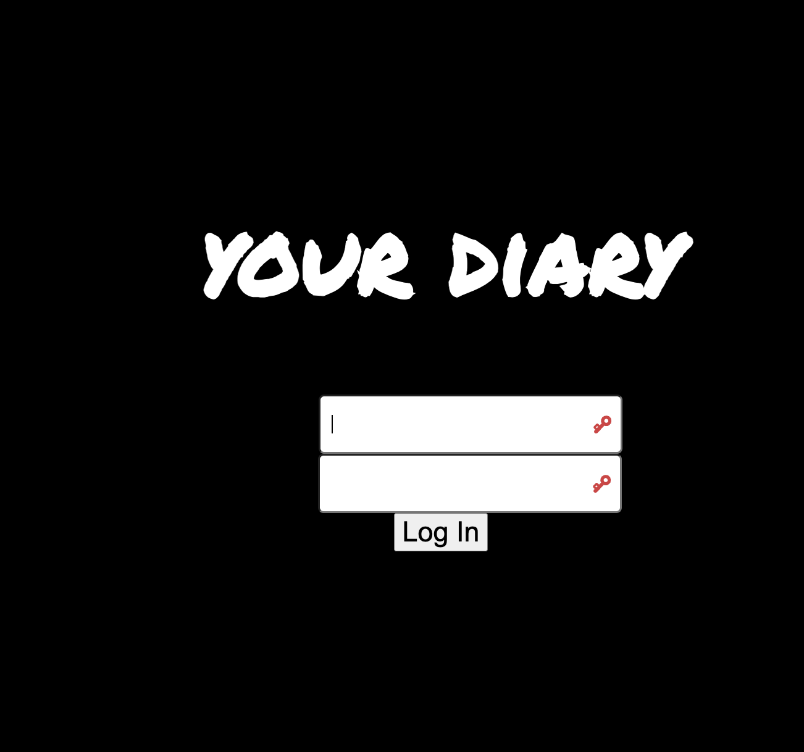

# MyDiary?
This is my 4th app as a software developer. I created this app as a gift to myself to track my physical, mental and emotional habits while living abroad. Transitioning can be difficult and staying on track with the habits that ground you and the goals that fulfill you can be overwhelming in the midst of adjusting to a new place. This is **MyDiary**.

I developed this app using **HTML, CSS**, **Python** and **Django**.
## Technologies Used
* CSS
* Python
* Django
* PostGres SQL

## Project Planning
* As I was planning my app I used Canva to design my wireframe. You can see visuals of my process [here](https://www.canva.com/design/DAGSpGhN4r0/qA3auPGdVKYLbq01p-bLKg/edit?utm_content=DAGSpGhN4r0&utm_campaign=designshare&utm_medium=link2&utm_source=sharebutton)
* I used **Lucid** to design my ERD.
* I used **Trello** to document my ERD and User Stories. [here]
(https://trello.com/b/T4znU83F/habit-tracker-django-app) 

## How to Use
When you open the app, start by signing up with a username and password. When you log in, the app automatically creates a new diary entry for the day. Each diary entry has a physical, emotional and mental model to track how you are doing in all 3 areas. 

## Future Updates
* Creating a goals page. 
* Editing my CSS. 
* Adding photos through AWS.

## Live Demo
You can use my first ever app creation **howUdoin?** [here](https://howudoin-fa786f7b4a41.herokuapp.com/)

### Screenshot
